# Feature Knowledge Library (RAG)

Turning a feature inventory into a retrievable knowledge layer — so a business user can ask
"which feature should I use, how does it work, how stable is it?" in natural language instead
of asking a platform owner.

**Prototype:** [`特征RAG-原型-v0.3_2.html`](https://htmlpreview.github.io/?https://github.com/yg674-dev/feature-knowledge-library-rag/blob/main/%E7%89%B9%E5%BE%81RAG-%E5%8E%9F%E5%9E%8B-v0.3_2.html)
· **PRD source:** [`Feature Knowledge Library RAG PRD_5.html`](https://htmlpreview.github.io/?https://github.com/yg674-dev/feature-knowledge-library-rag/blob/main/Feature%20Knowledge%20Library%20RAG%20PRD_5.html) (bilingual)

This README is the PRD in full, in English.

---

## 1. Business goal

Feature discovery is rate-limited by the platform team. Every strategy author who needs a feature
they did not personally request has to go ask someone, which makes strategy throughput a function
of owner availability — and quietly rewards creating a near-duplicate feature over waiting for an
answer.

The goal is to take the platform team out of that loop: cut discovery from minutes of asking a
person to seconds of asking the system, raise reuse of features that already exist, and turn
new-feature quality into a gate rather than a review habit.

What that requires: the platform holds thousands of governance features, but a business user knows
only the handful they requested themselves, and the Feature List shows what *exists* without
showing what is *retrievable* — so nobody can tell which features an agent can actually reach.
This turns the inventory into a knowledge layer: embedding-ready structured text per feature, index
and sync state made visible, an agent that interviews a requester into a complete proposal instead
of handing them a 19-field form, and an always-on Ask AI that returns cards a user can act on — and
says so plainly when it has nothing rather than inventing a feature.

Prototype baseline: **7,024 features, 6,683 indexed — 95.1%**.

Four requests, delivered as one product:

1. Upgrade the existing Feature List into a searchable **Feature Knowledge Library**.
2. Show embedding-ready **structured text and RAG status** on the feature detail page.
3. Provide **New feature entry · Ask AI** in the new-feature flow, so users with RAG edit
   permission generate a feature proposal through Agent Q&A.
4. Provide an **always-on Ask AI entry** for feature discovery and detail navigation.

## 2. Problem

**P1 — Discovery is a person, not a system.** The platform holds thousands of features, but a
business user typically knows only the handful they requested themselves. Finding a feature still
means asking a platform owner by hand, and the things that decide whether a feature is usable —
semantics, code logic, usage scope, stability, data source — are not organized as anything a
retrieval system can search.

**P2 — The Feature List is an inventory, not a knowledge layer.** It exposes no embedding status,
no sync status, no failed-re-index handling, and no recall validation, so a PM or RD cannot tell
whether a given feature is even reachable by Ask AI yet.

**P3 — Creating a feature front-loads the wrong work.** Users should not hand-fill a long RAG
template before describing what they need. The natural path starts from the business need and lets
the Agent ask for feature meaning, entity, data source, owner, usage example, and risk/limitation.

**P4 — There is no in-platform way to just ask.** Business users need to ask "which feature should
I use / what is the logic / how stable is it" in natural language, then navigate from a result card
back to the detail page to confirm.

## 3. Goals and key metrics

| Goal | Metric | Owner |
| --- | --- | --- |
| **Improve searchable feature coverage** | Prototype baseline **7,024 features, 6,683 indexed, 341 failed — 95.1%**. P0 target: **indexed availability ≥ 99%**, failed items batch re-runnable with failure reasons preserved | Feature Platform RD / PM |
| **Reduce feature discovery effort** | From minutes of asking a platform owner → **≤ 30s** to Ask AI's first response; Feature Card → detail page in **1 step** | PM / DA |
| **Improve new-feature completeness** | A proposal must reach **19/19** required fields, and the latest confirmed version must pass Skills Evaluation at **6/6** before Submit. Coverage of both gates = **100%** | PM / RD |
| **Make RAG recall verifiable** | Every detail page shows structured text, embedding model, chunk count, vector ID, and last-synced. Users confirm from an Ask AI card through F2 | RD |

## 4. Scope

| Surface | Layer | Requirement | Priority |
| --- | --- | --- | --- |
| Knowledge Library | FE | Upgrade the Feature List into a management page with KPI, filters, RAG Status, Last Synced, batch Re-index, per-row View RAG / Re-run | **P0** |
| Knowledge Library | BE | Sync base fields from Feature Platform Meta, map Knowledge Library and embedding-pipeline statuses, return failure reasons, support batch retry | **P0** |
| Feature Detail | FE | Three-column read-only Meta, Structured Text, RAG Status, plus a read-only Recall Test. View / confirm / Regenerate / Re-index only — no creation, no backfill | **P0** |
| Feature Detail | BE | Generate embedding-ready structured text; return vector ID, embedding model, chunk count, sync time, coverage, recall result; optional `output_samples` for categorization features | **P0** |
| New Feature Entry · Ask AI | FE | Agent Q&A primary, manual template secondary. Show `Required N/19` and the generated proposal live. Confirm at 19/19, lock after Confirm, Submit only after Evaluation 6/6 | **P0** |
| New Feature Entry · Ask AI | BE / Agent | Run six Skills Evaluation checks after Confirm; on failure return itemized fixes requiring re-Confirm and re-Evaluate. Submit writes to Feature Platform Meta + Knowledge Library and enters the embedding queue | **P0** |
| Ask AI Widget | FE | Always-on bottom-right, coexisting with the Oncall widget. Suggested prompts, clarification options, Feature Cards, low-confidence and empty states; apply-permission modal blocks write mode | **P0** |
| Ask AI Widget | BE / Agent | Feature Discovery only. Consume **INDEXED** knowledge; return `NEED_CLARIFICATION` / `FEATURE_CARDS` / `LOW_CONFIDENCE` / `NO_RESULT` with explanations, confidence, and navigation metadata | **P0** |
| Output Samples hover | FE | `enum · N` badge beside the feature code for categorization features; hover shows the first five value → meaning pairs, `+N more` opens F2 | P2 |
| Ask AI / Oncall merge | — | Align with the Oncall team later. P0 does not change the Oncall widget and must not block the RAG launch | P2 |

## 5. User journey

Two flows, one product. **Flow A** is the read capability — any user with Ask AI access finds a
feature in natural language and confirms it on the detail page. **Flow B** is the write
capability — a user with RAG edit permission contributes or maintains knowledge through Agent
Q&A, and it reaches production only through evaluation and embedding.

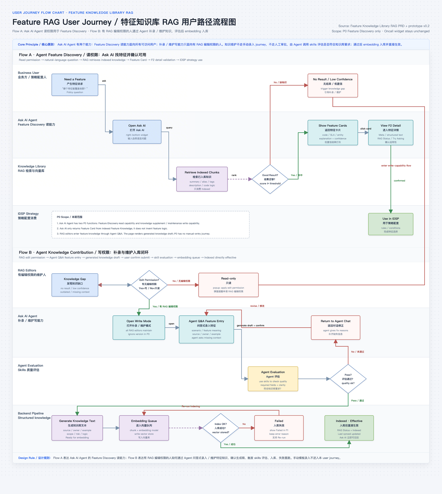

The core principle the diagram encodes: **knowledge maintenance does not go through a manual
entry journey and does not go through human approval.** The Agent invokes skills to evaluate
whether a draft meets knowledge-library requirements; passing that evaluation is what makes it
effective.

### Flow B in detail · Agent Q&A feature entry

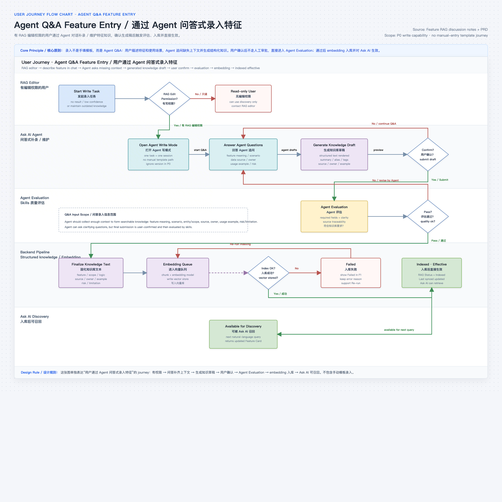

`RAG editor → describe the feature in chat → Agent asks for missing context → generated knowledge
draft → user confirm → evaluation → embedding → indexed and effective`. A read-only user branches
out at the permission check and keeps discovery only.

### Step by step


1. PM/RD opens **Knowledge Library**, checks indexed/failed totals, and filters by name/code, type,
   owner entity, data source extra, and RAG Status.
2. **View RAG** opens the feature detail page to check Meta, Structured Text, and embedding status.
   F2 is for viewing and final confirmation only — it hosts no creation or backfill.
3. A user with RAG edit permission opens F3 and sees the empty-state **New feature entry · Ask AI**.
   *Start Agent Entry* sits **before** *Start from describing*, deliberately: the user should begin
   from the business need, not from a blank template.
4. **Start Agent Entry** opens a two-panel window — Agent Q&A collects fields on the left, the
   **Generated New Feature Proposal** renders live on the right with `Required N/19`.
5. At **19/19**, *Confirm Proposal* locks the proposal, then six **Skills Evaluation** checks run.
   On `EVALUATION_FAILED`, the user fills the gaps through Q&A; the updated proposal must be
   confirmed and evaluated **again**.
6. **Submit** unlocks only at 6/6. It writes to Feature Platform Meta + Knowledge Library, enters
   the embedding queue, and closes the conversation. The feature becomes `INDEXED` after embedding
   succeeds. One feature = one conversation.
7. A business user clicks **Ask AI** from any page and gets one of four states. Normal cards open
   F2; the no-result creation branch opens F3 for permitted users, or an apply-permission modal.

## 6. F1 · Knowledge Library

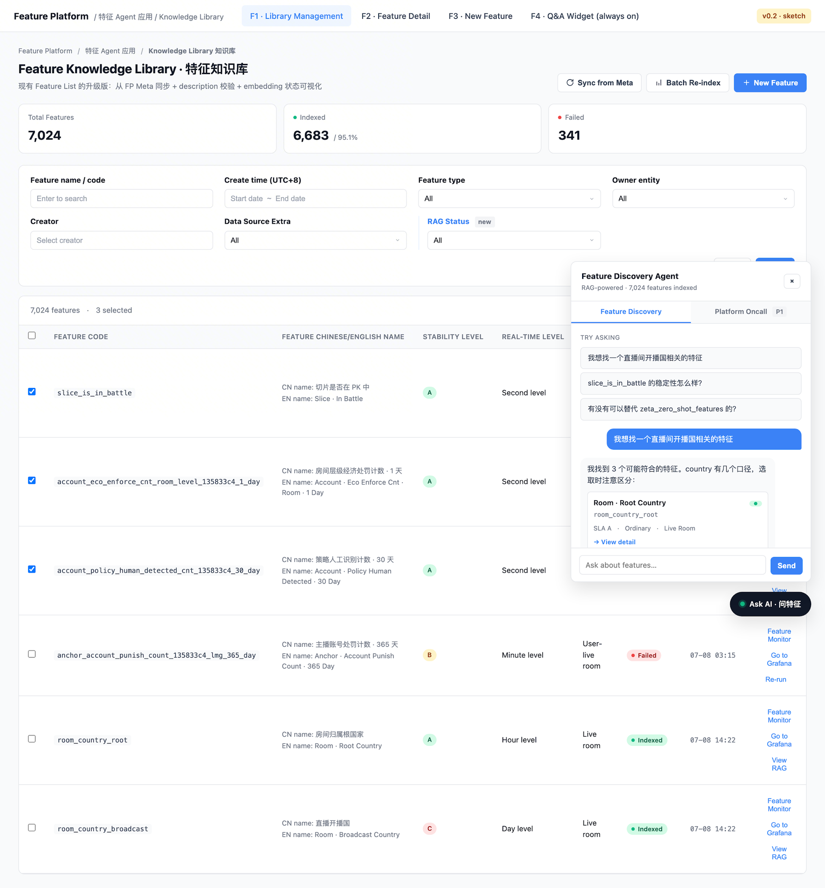

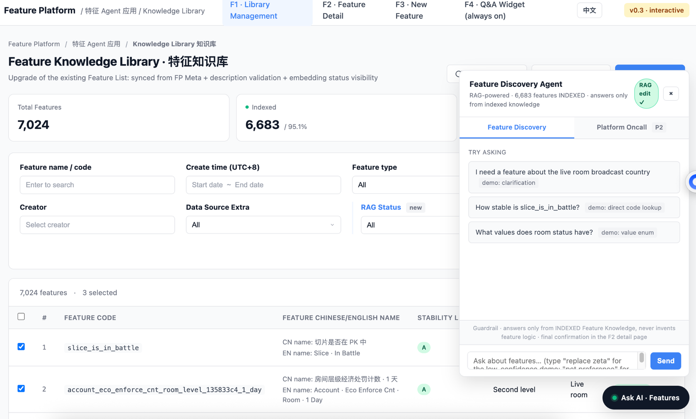

| Area | Behavior |
| --- | --- |
| **KPI** | Total Features, Indexed, Failed. Prototype baseline **7,024 / 6,683 / 341**, indexed 95.1% |
| **Filter** | Existing name/code, create time, type, owner, creator, data source extra — plus **RAG Status** (All / Indexed / Failed) |
| **Table** | Adds **RAG Status** and **Last Synced**. Indexed rows show *View RAG*; failed rows show *Re-run*. Multi-select supports *Re-index (N)* and *Export* |
| **Sync** | *Sync from Meta* pulls base fields from Feature Platform Meta into the library. *Batch Re-index* returns selected features to the embedding pipeline |
| **Output Samples hover** *(P2)* | `enum · N` beside the code, categorization features only. Hover shows the first five value → meaning pairs, `+N more` opens F2. Demonstrated in the prototype; held at P2 by the 07/28 review |

## 7. F2 · Feature Detail

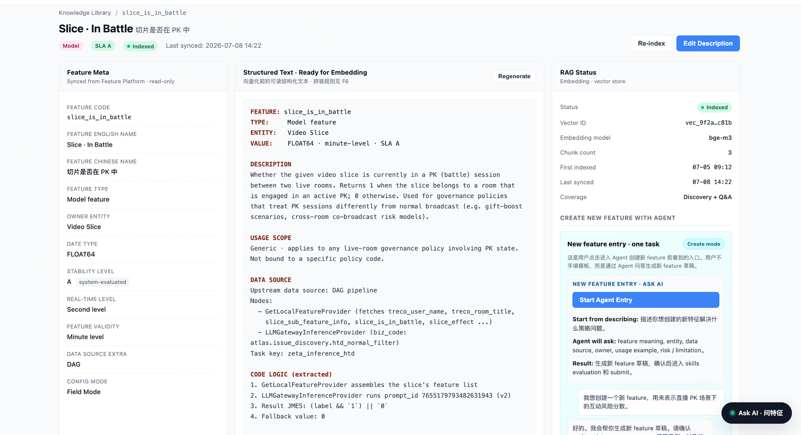

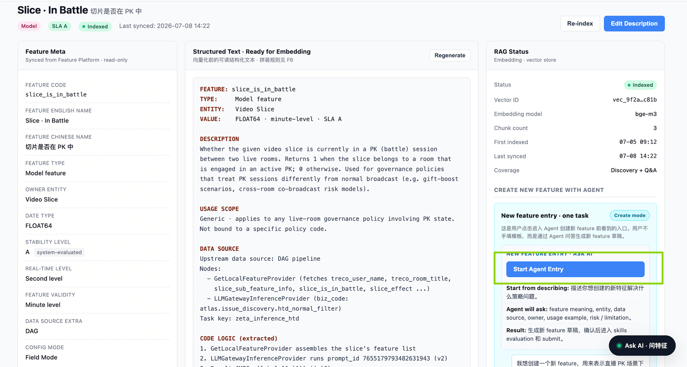

| Column | Contents |
| --- | --- |
| **Feature Meta** *(left, read-only)* | code, EN name, CN name, type, owner entity, data type, stability, real-time level, validity, data source extra, config mode. Only *Edit Description* writes back |
| **Structured Text** *(middle)* | The readable pre-embedding text, assembled from Meta, description, usage scope, data source, code logic, rate limit. *Regenerate* rebuilds it |
| **Output Samples** | Below Config Mode. The complete enum list plus each value's business meaning — answering *how many values does this feature have* and *what does each mean* (e.g. `room type` has 10 values; `001 = "Game LIVE room"`). Feeds the embedding text; Agent Q&A can query it directly |
| **RAG Status** *(right)* | status, vector ID, embedding model, chunk count, first indexed, last synced, coverage. The prototype shows `bge-m3`, chunk count 3 |
| **Recall Test** *(right, read-only)* | Runs a real user question against the current feature and shows top-N hit, score, and display threshold. Consumes only INDEXED vectors; never modifies retrieval from F2 |

**Output Samples scope:** categorization features only, **optional**. Model features have fixed
score ranges (−1 to 100) and do not need them. Values can be extracted from what dev teams already
store — they match the enum values in IDSP condition dropdowns (e.g. `RoomStatusEnum_Prepare /
Living / Pause / Finish`). MVP excludes IDSP-side hit/not-hit: feature values are what decide
strategy adoption.

**Boundary:** F2 does not host new-feature creation or backfill. That belongs to F3.

## 8. F3 · New Feature Entry · Ask AI

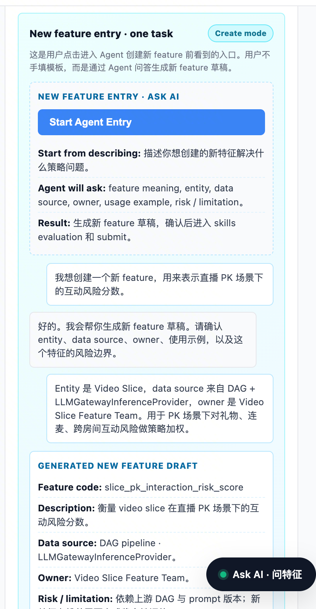

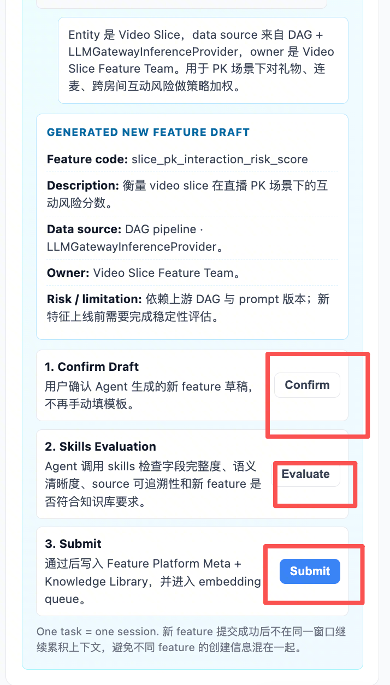

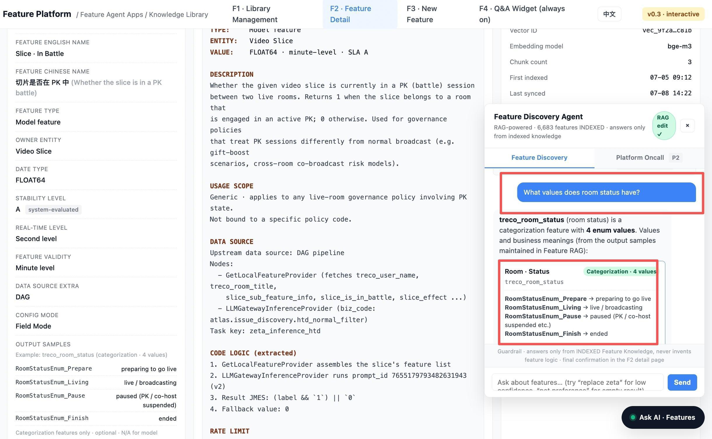

**Dual path, one gate.** Agent Q&A is the main path; the manual template is retained as a secondary
path to bound token cost. Both write the same field contract and pass the same Skills Evaluation
gate — the manual path **cannot** bypass evaluation.

### The 19 required fields

`Feature English name` · `Feature Chinese name` · `Short description` · `Feature code` ·
`Owner entity` · `Owner team` · `Feature type` · `Data type` · `Real-time level` · `Freshness` ·
`Source` · `Usage` · `Scope` · `Supported regions` · `Feature description` · `Coding` ·
`Data source` · `Usage example` · `Risk / limitation`

### Field groups

| Section | Fields | Rule |
| --- | --- | --- |
| **Basic Info** | EN name, CN name, short description, code, owner entity, owner team, feature type, data type, stability level, real-time level | All except **Stability level** count toward the 19. Stability is system-evaluated and may show *pending eval* |
| **RAG Classification** | Freshness, Source, Usage, Scope | Usage is multi-select, minimum one. RAG discovery is optional but should default on for anything entering the library |
| **Coverage** | Business domain, Scenarios, Supported regions, Not available in | **Supported regions** counts toward the 19. Scenarios becomes conditionally required when `Scope = Scenario specific` |
| **Feature Content** | Feature description, Coding, Data source | All three are P0 required. Coding is RD-filled in P0 and may later be inferred by the Agent from strategy code and lineage |
| **RAG Discovery** | Search summary, Aliases, RAG tags, Common questions, Usage example, Risk / limitation, Output samples | **Usage example** and **Risk / limitation** count toward the 19. The rest are optional but recommended. Output samples: categorization features only |
| **Submission gate** | Required 19/19 · Confirmed & locked · Skills Evaluation 6/6 | All three, no exceptions, both paths |

### Confirm, evaluate, submit

- **Confirm Proposal** locks the proposal and enables *Run Skills Evaluation*. It does **not** write
  to the production library.
- **Six Skills Evaluation checks:** ① required-field completeness ② semantic clarity ③ source/owner
  traceability ④ usage-example recallability ⑤ risk/limitation coverage of launch boundaries
  ⑥ classification/region consistency. While running, status is `AGENT_EVALUATING` and both
  re-evaluation and Submit are blocked.
- **Any Q&A edit creates a new proposal version and invalidates the previous Confirm and Evaluation.**
  The backend must reject a Submit unless the *latest* version passed. Evaluation runs **after
  Confirm**, not after Submit — corrected in the 07/29 revision.
- **`EVALUATION_FAILED`** keeps the window open and returns itemized fixes. The v0.3_1 demo passes
  5/6 and fails risk-boundary coverage, asking for a pre-launch stability evaluation, failure
  scenarios from prompt/upstream version changes, and timeliness boundaries such as the latency
  window after a PK ends.
- **Submit** writes to Feature Platform Meta + Knowledge Library, enters the embedding queue, and
  closes the conversation. `INDEXED` — and therefore retrievability — comes only after embedding
  succeeds. One feature task = one conversation.

## 9. F4 · Ask AI Widget

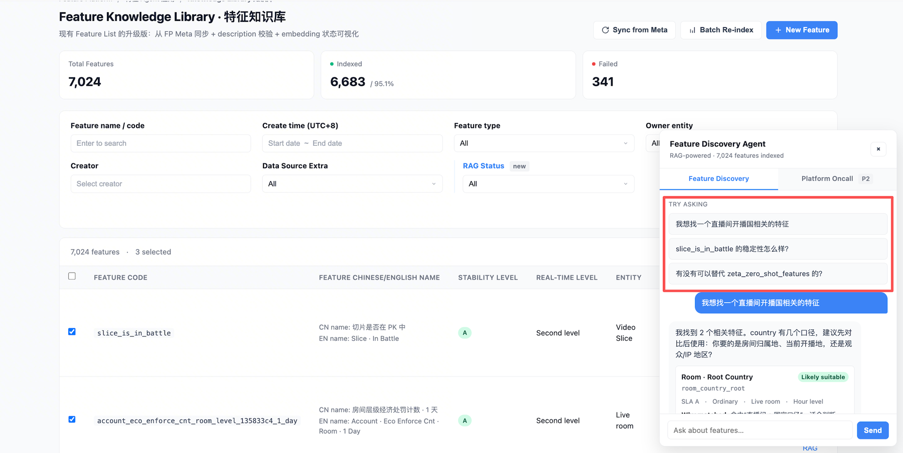

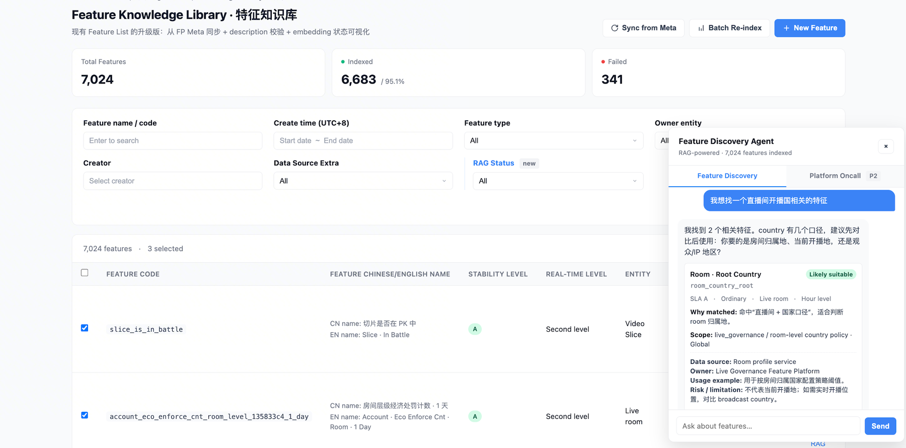

Always-on, bottom-right, coexisting with the existing Oncall widget. **Feature Discovery is the
only P0 mode.**

| State | Trigger | Behavior |
| --- | --- | --- |
| **`NEED_CLARIFICATION`** | The query is broad and candidates span easily confused business definitions | **At most one** option-based clarification round, using chips, with *Skip*. After an answer or Skip, return Feature Cards — later ambiguous queries in the same conversation get ranked candidates, never another follow-up |
| **`FEATURE_CARDS`** | Normal semantic retrieval, or an explicit code/name lookup | Explain the business definition first, then rank. Direct code/name lookup skips the explanation. **Cards are never labeled *Recommended*** — only *Likely suitable* / *Likely not suitable* / *Need more context* |
| **`LOW_CONFIDENCE`** | Top candidate scores below the display threshold | Gray the cards, show *Low confidence* with the actual score and threshold, ask for more scenario context. **Low-confidence cards cannot navigate to F2** — a weak match must not read as a usable conclusion |
| **`NO_RESULT`** | Nothing usable retrieved from INDEXED knowledge | State plainly that the system **will not invent feature logic**. Offer *Rephrase* and *Create in F3*. Permitted users land in F3 Agent Entry; others get `PERMISSION_REQUIRED` and an apply-permission modal |

**Feature Card contract:** CN/EN name, `feature_code`, why matched, scope, SLA / real-time /
validity, data source, owner, usage example, risk / limitation, *View detail to confirm*. Enum
questions are answered from `output_samples`.

**Guardrail:** Ask AI consumes only INDEXED knowledge and must not invent feature logic. It may
offer a light fit judgment such as *likely suitable*, but **final confirmation happens in F2**.

**Future:** Phase 2 adds memory, multi-turn, favorites. Phase 3 integrates Lark dialogs on the
same agent foundation.

## 10. Backend data contract

| Object | Required fields | Notes |
| --- | --- | --- |
| **Feature Meta** | `feature_code`, `feature_name_en`, `feature_name_cn`, `feature_type`, `owner_entity`, `owner_team`, `data_type`, `stability_level`, `real_time_level`, `feature_validity`, `data_source_extra`, `config_mode` | Existing features sync from Feature Platform Meta and are read-only on the detail page. A new feature is written only after Evaluation passes and the user submits |
| **Knowledge Library Extension** | `short_description`, `freshness`, `source`, `usage`, `scope`, `business_domain`, `scenarios`, `supported_regions`, `not_available_in`, `feature_description`, `coding`, `data_source`, `search_summary`, `aliases`, `rag_tags`, `common_questions`, `usage_example`, `risk_limitation`, `output_samples` | Drafted by Agent Entry or the manual template. Confirm and Evaluation write nothing to production — only a post-6/6 Submit writes both Meta and Library. `output_samples` is optional, categorization-only, and enters the embedding text |
| **Proposal & Evaluation State** | `required_field_count`, `required_field_total` (= 19), `proposal_status`, `confirmed_version`, `evaluation_status`, `evaluation_checks` (6), `evaluation_fix_suggestions` | States: collecting → ready to confirm → confirmed/locked → evaluating → failed/passed → submitted. Any Q&A edit creates a new version and invalidates the prior Confirm and Evaluation |
| **Embedding Status** | `rag_status`, `vector_id`, `embedding_model`, `chunk_count`, `first_indexed_at`, `last_synced_at`, `coverage`, `last_error_code`, `last_error_message` | Drives the list page, detail page, and failed re-run |

## 11. Status and error codes

| Code | Meaning | Raised by | UX |
| --- | --- | --- | --- |
| `AGENT_EVALUATING` | Evaluating the latest confirmed proposal | Backend / Agent | Keep the modal open, show progress across six checks, disable duplicate Evaluation and Submit |
| `EVALUATION_FAILED` | At least one of six checks failed | Agent | Return itemized fixes, keep the modal open. Q&A edits invalidate the prior Confirm/Evaluation |
| `EVALUATION_PASSED` | All six passed | Agent | Enable Submit. **Nothing is written yet** |
| `INDEXED` | Embedding complete and effective | Backend | List shows *Indexed*, detail shows vector info, Ask AI can retrieve immediately |
| `INDEX_FAILED` | Text assembly, embedding, or vector-store write failed | Backend | List shows *Failed*, operation shows *Re-run*, detail shows the reason |
| `VALIDATION_FAILED` | Required fields missing or malformed | FE / BE | Inline field warnings; block Confirm or manual-template entry into Evaluation |
| `PERMISSION_REQUIRED` | No RAG edit permission | BE / FE | Apply-permission modal with Cancel / Apply; **no entry into F3 write mode** |
| `FEATURE_CARDS` | Normal retrieved candidates | BE / Agent | Ranked cards, F2 navigation, business makes the final call |
| `LOW_CONFIDENCE` | Top score below threshold | Backend | Gray results, disclose score/threshold, request context, **no F2 navigation** |
| `NO_RESULT` | No usable INDEXED feature | Backend | **Do not invent an answer.** Offer Rephrase / Create in F3, routed by permission |
| `NEED_CLARIFICATION` | Query too broad or candidate definitions conflict | BE / Agent | At most one clarification round per conversation |

## 12. Structured text generation

- Assembled from Feature Meta + Knowledge Library Extension in this order: `FEATURE`, `TYPE`,
  `ENTITY`, `VALUE`, `DESCRIPTION`, `USAGE SCOPE`, `DATA SOURCE`, `CODE LOGIC`, `RATE LIMIT`,
  `RISK / LIMITATION`. Categorization features additionally include `OUTPUT SAMPLES`
  (complete value → meaning); model features skip it.
- **Regenerate rebuilds the structured text only** — it never overwrites user-entered source
  fields, and re-embedding runs only after the user confirms.
- Each successful embedding updates `vector_id`, `chunk_count`, `last_synced_at`, and `rag_status`.

## 13. Permission model

- **Read** (Feature Discovery) is open to anyone who can reach Ask AI. **Write** (new feature
  creation) requires RAG edit permission.
- Agent and manual paths share the same 19 fields and the same gate. Below 19/19, Confirm and
  Evaluation are blocked for both.
- Batch Re-index must log operator, time, feature count, success/failure counts, and failure reasons.

## 14. Rollout

| Phase | Scope | Exit criteria |
| --- | --- | --- |
| **Phase 1 / P0** | Knowledge Library, Feature Detail, New feature entry · Ask AI, Agent Evaluation, Ask AI Feature Discovery — launched independently | Indexed availability ≥ 99% · all four Ask AI states return correctly · Confirm only at 19/19 · six checks return itemized results and fixes · Submit only at 6/6 · submission enters the embedding queue · Failed supports retry |
| **Phase 2 / P1** | Multi-turn Ask AI, memory, favorites; align with Oncall on merging | Decide whether Oncall merges into Ask AI or stays independent |
| **Phase 3 / P2** | Lark dialog integration on the same agent foundation | Lark and in-platform Ask AI return consistent discovery results |

## 15. Open questions

1. **Embedding model** — keep the prototype's `bge-m3`, or align with the V3.1 proposal's
   `bge-base-zh-v1.5` / 768 dim? RD to confirm.
2. **Agent Evaluation** — which skills, what per-check scoring thresholds, and which are blocking?
3. **Ask AI thresholds** — low-confidence cutoff, no-result cutoff, and Top-N return count.
4. **Event tracking** — Ask AI open/send/suggest click, `response_state`, clarification option/skip,
   card expand/click, View detail, Start Agent Entry, Q&A send, required-count change, Confirm,
   proposal unlock/edit, Run Skills Evaluation, evaluation failed/passed/retry, Submit, Start new
   conversation, Create new feature, permission modal open/apply, Re-index, manual-template submit.

## 16. What's in this repo

| File | Type | Version | Date |
| --- | --- | --- | --- |
| [`特征RAG-原型-v0.3_2.html`](https://htmlpreview.github.io/?https://github.com/yg674-dev/feature-knowledge-library-rag/blob/main/%E7%89%B9%E5%BE%81RAG-%E5%8E%9F%E5%9E%8B-v0.3_2.html) | Prototype | v0.3_2 | 2025-08-04 |
| [`特征RAG-原型-v0.2.html`](https://htmlpreview.github.io/?https://github.com/yg674-dev/feature-knowledge-library-rag/blob/main/%E7%89%B9%E5%BE%81RAG-%E5%8E%9F%E5%9E%8B-v0.2.html) | Prototype | v0.2 | 2025-07-23 |
| [`docs/Feature-Knowledge-Library-RAG-PRD.pdf`](docs/Feature-Knowledge-Library-RAG-PRD.pdf) | PRD (PDF, with journey diagrams and UI) | — | 2026-09 |
| [`Feature Knowledge Library RAG PRD_5.html`](https://htmlpreview.github.io/?https://github.com/yg674-dev/feature-knowledge-library-rag/blob/main/Feature%20Knowledge%20Library%20RAG%20PRD_5.html) | PRD (bilingual) | v5 | 2025-07-30 |

**Changelog highlights** — output samples added under Code Logic and scoped to categorization
features (07/28) · evaluation timing corrected from post-Submit to post-Confirm, 19 required fields
and 6 evaluation checks specified, four Ask AI states completed (07/29).

```bash
git clone https://github.com/yg674-dev/feature-knowledge-library-rag.git
cd feature-knowledge-library-rag
open "特征RAG-原型-v0.3_2.html"
```

Self-contained HTML — no build step, no server.
